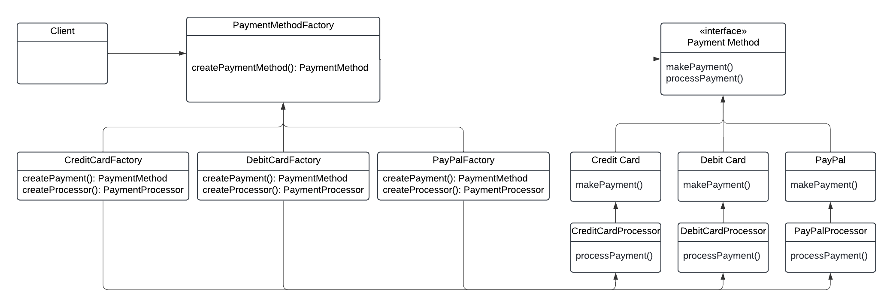

An Abstract Factory is useful for **encapsulating** the creation of *families* of related or dependent objects, ensuring that products are compatible with each other. By using an Abstract Factory, the client is **decoupled** from the specific classes of the objects it needs, making the code easier to **maintain** and adapt to changes. Additionally, it helps ensure **consistency** by **reusing** common creation logic for related products across various parts of the application. The Abstract Factory defines a Factory Method per product. 

